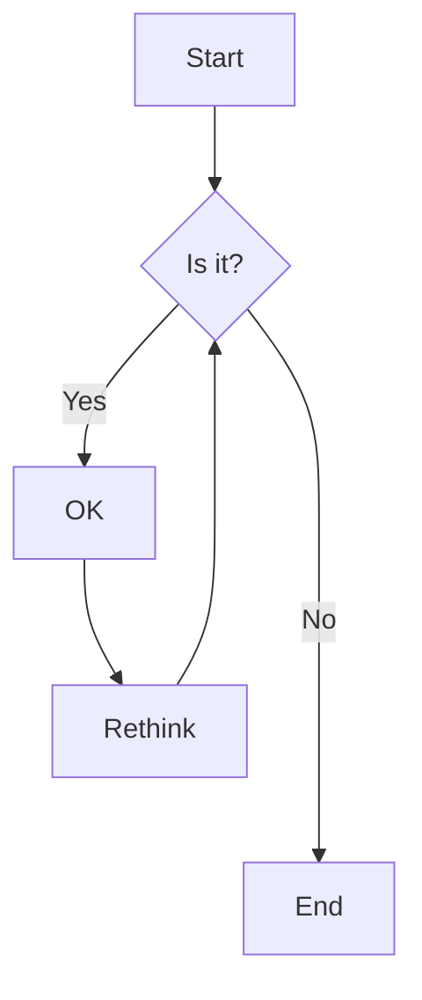

# Bonnes pratiques de débogage

Tout d'abord, garde en tête que l'objectif est de maitrise ces techniques à la fin de ta formation.

Donc:

1. la première fois qu'un type de blocage t'arrive, demande à ton prof pour bénéficier de son expérience en débogage ... où mettre le point d'arrêt ... etc.
2. la deuxième fois, essaie d'investiguer par toi-même mais si tu bloques après 5-10 minutes, ça ne sert à rien de s'obstiner et potentiellement de rager
3. si par la suite, tu n'y arrives toujours pas, on sera toujours là pour t'aider, il faudra peut-être revoir ton approche.

## Reproduire le bogue

Pour pouvoir travailler sur un bogue, il faut d'abord rendre explicite comment le reproduire.

Tu vas utiliser cette séquence d'actions pour déboguer mais aussi pour valider ta solution. Quand tu as récupéré le comportement attendu, ton bogue est résolu.

Si le bogue semble apparaître de manière aléatoire, n'hésite pas à demander à ton prof, il aura peut-être une idée pour le reproduire de manière fiable.

### A la main

Tu peux commencer par décrire les étapes à réaliser pour reproduire le bogue:

- quoi faire depuis le lancement de ton projet jusqu'au plantage
- essaie de décrire les étapes de la manière la plus détaillée possible
- cela servira de base de conversation si tu demandes de l'aide pour le bogue
- on recommande de le faire dans un fichier texte dans ton projet, possiblement en MarkDown

```
#mise en place
Partir l'application
Cliquer sur inscription pour aller sur l'écran d'inscription
Remplir le champ utilisateur avec la valeur "pipo"
Cliquer sur m'inscrire
#comportement attendu
J'arrive sur l'écran d'accueil
#comportement observé
Crash
```

### Automatique (ne lis pas ça tant que tu n'as pas eu de cours sur les tests automatiques)

Si c'est possible tu peux aussi produire un test unitaire qui illustre le bogue.

- préparation de l'état où le bogue va se produire
- déclenchement
  Ce test va échouer tant que le bogue est là

## Demander de l'aide

### Prof

Si tu es en cours, après 10 minutes à essayer, demande à ton prof.
Si tu n'est pas en cours, écris nous sur Teams.

### ChatGPT

### StackOverFlow

### Ami

On vous encourage à vous entraider. Garde juste en tête
que ton ami vient juste d'apprendre, il ne sait pas tout.

## Points d'arrêts, règles de base

Le point d'arrêt te permettent d'arrêter le temps, de regarder ce que valent les variables et enfin de comprendre
pourquoi l'ordinateur ne fait pas ce que tu penses qu'il doit faire.

Quelques règles générales

- tu dois placer un breakpoint sur une ligne avec une instructions, pas sur une ligne vide ou un commentaire par exemple
- tu devrais laisser les points d'arrêts jusqu'à avoir résolu le problème, si tu as besoin d'aide, le placement de tes breakpoints aidera la personne à comprendre où tu es rendu
- tes points d'arrêt te servent à identifier la ligne de code où ce que tu as écrit ne fait pas ce que tu penses, on cherche donc la ou les lignes de code fautives

## Evaluateur d'expression / console

Une fois que ton application est sur un point d'arret, tu peux regarder les différentes valeurs. Maintenant tu peux aussi evaluer une nouvelle expression ou declencher du code dans le contexte du point d'arret:

- dans les IDE de Jetbrains, clic droit quand on est sur un point d'arret et choisir evaluate expression
- dans chrome, quand on est sur un point d'arret, taper une expression dans la console puis ENTER

## Débogage quand ça crash et que j'ai une trace (stacktrace ou trace de la pile d'appels)

Quand une application ou un serveur plante, juste avant de mourir, il donne habituellement une trace de la pile d'appels au moment du drame.

On va voir comment lire ce message et où placer ton point d'arrêt pour tenter d'élucider les causes

```
Exemple de stacktrace Java
```

En Java, le meilleur candidat pour placer ton point d'arret est la premiere ligne surlignée en bleu. Il s'agit de la méthode la plus haute dans la pile d'appels au moment du crash qui vient de ton code:

- le code des librairies standards ou extérieures est le plus souvent sans bogue
- la méthode la plus haute dans la pile est celle qui a commencé à s'exécuter en dernier

En ré-éxécutant les mêmes étapes qui ont amené au crash, exécute en débogage et observe les différentes valeurs des valeurs à ce point dans le code.

```
Exemple de stacktrace C#
```

## Débogage HTTP / réseau

Pour le débogage d'un appel réseau, il y a quatre cas possible:

- bogue avant que la requête parte
- bogue d'acheminenement, ça ne se rend pas
- bogue sur le serveur pendant le traitement de la requête
- bogue au retour de la requête

La plupart des environnements de développement permettent de voir les requêtes qui partent et qui reviennent:

- en web, l'outil que nous recommandons et l'onglet "network" de l'inspecteur https://developer.chrome.com/docs/devtools/network/
- dans Android Studio, on peut utiliser la vue "App Inspection" qui contient un onglet "Network" https://developer.android.com/studio/debug/network-profiler?hl=fr
- en développement Flutter https://docs.flutter.dev/tools/devtools/network

Ces outils permettent de voir les requêtes partir et/ou revenir, d'inspecter ce qui a été envoyé et reçu etc.

## Débogage pour un appel à un serveur / pour un appel asynchrone

Pour un appel asynchrone, il est important de mettre un point d'arrêt

```java

```

# Une fois le bogue résolu

## Commit de bogue (oublie ça si tu n'as pas encore vu Git)

Le titre de ton commit ressemblera sans doute à _BUGFIX: problème d'affichage dans l'adapteur du recycler accueil résolu_

Toutefois, nous t'encourageons à produire une description détaillée avec les étapes que tu as suivi voir les choses que tu as réalisées. On apprend souvent
beaucoup plus quand on se plante que quand ça marche. Pour l'exemple précédent:

```
L'appli plante dès que j'ajout une objet dans le recyclerview
Débogage montre que le plantage se fait sur un setText dans le recyclerView en indiquant "resource not found for id 0x84487328"
Recherche Google avec "resource not found for id Android setText"
Solution trouvée sur post : "https://stackoverflow"
setText avec un int cherche une resource dans un fichier de traduction strings.xml
Bonne pratique pour la suite toujours faire setText(""+variableEntiere) au lieu de setText(variableEntiere)
```

Comme ça tu gardes une trace pour ton toi du futur. Si tu retombes sur truc similaire, tu peux chercher ton repo, retrouver ton cheminement etc.

## Apprentissage

Parfois un bogue est vraiment une erreur d'inattention, un détail.

D'autre fois, la solution d'un bogue va te faire comprendre un nouvel élément que tu ne maitrisais pas avant. Dans ce cas, tu peux revisiter le reste de ton application
pour voir si d'autres parties de ton code devrait être revu. Par exemple, si tu viens de réaliser que **==** en Java teste si deux objets sont en fait le même au lieu de
tester l'égalité (qui se fait avec **.equals(...)**), alors tu devrais sans doute chercher tous les == dans ton projet pour voir si il n'y a pas d'autres erreurs.


