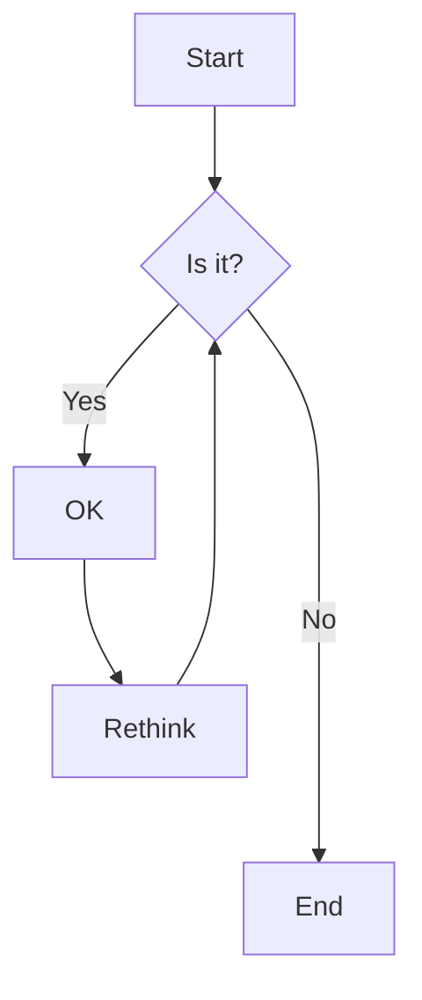

# Bonnes pratiques de débogage

## Points d'arrêts,  règles de base
Le point d'arrêt te permettent d'arrêter le temps, de regarder ce que valent les variables et enfin de comprendre 
pourquoi l'ordinateur ne fait pas ce que tu penses qu'il doit faire.

Quelques règles générales
- tu dois placer un breakpoint sur une ligne avec une instructions, pas sur une ligne vide ou un commentaire par exemple
- tu devrais laisser les points d'arrêts jusqu'à avoir résolu le problème, si tu as besoin d'aide, le placement de tes breakpoints aidera la personne à comprendre où tu es rendu
- tes points d'arrêt te servent à identifier la ligne de code où ce que tu as écrit ne fait pas ce que tu penses, on cherche donc la ou les lignes de code fautives

## Evaluateur d'expression / console

Une fois que ton application est sur un point d'arret, tu peux regarder les différentes valeurs. Maintenant tu peux aussi evaluer une nouvelle expression ou declencher du code dans le contexte du point d'arret:
- dans les IDE de Jetbrains, clic droit quand on est sur un point d'arret et choisir evaluate expression
- dans chrome, quand on est sur un point d'arret, taper une expression dans la console puis ENTER


## Débogage quand ça crash et que j'ai une trace (stacktrace ou trace de la pile d'appels)

Quand une application ou un serveur plante, juste avant de mourir, il donne habituellement une trace de la pile d'appels au moment du drame. 

On va voir comment lire ce message et où placer ton point d'arrêt pour tenter d'élucider les causes
```
Exemple de stacktrace Java
```
En Java, le meilleur candidat pour placer ton point d'arret est la premiere ligne surlignée en bleu. Il s'agit de la méthode la plus haute dans la pile d'appels au moment du crash qui vient de ton code:
- le code des librairies standards ou extérieures est le plus souvent sans bogue
- la méthode la plus haute dans la pile est celle qui a commencé à s'exécuter en dernier

En ré-éxécutant les mêmes étapes qui ont amené au crash, exécute en débogage et observe les différentes valeurs des valeurs à ce point dans le code.

```
Exemple de stacktrace C#
```

## Débogage HTTP / réseau

Pour le débogage d'un appel réseau, il y a quatre cas possible:
- bogue avant que la requête parte
- bogue d'acheminenement, ça ne se rend pas
- bogue sur le serveur pendant le traitement de la requête
- bogue au retour de la requête

La plupart des environnements de développement permettent de voir les requêtes qui partent et qui reviennent:
- en web, l'outil que nous recommandons et l'onglet "network" de l'inspecteur https://developer.chrome.com/docs/devtools/network/
- dans Android Studio, on peut utiliser la vue "App Inspection" qui contient un onglet "Network" https://developer.android.com/studio/debug/network-profiler?hl=fr
- en développement Flutter https://docs.flutter.dev/tools/devtools/network

Ces outils permettent de voir les requêtes partir et/ou revenir, d'inspecter ce qui a été envoyé et reçu etc.

## Débogage pour un appel à un serveur / pour un appel asynchrone
Pour un appel asynchrone, il est important de mettre un point d'arrêt

```java
```



