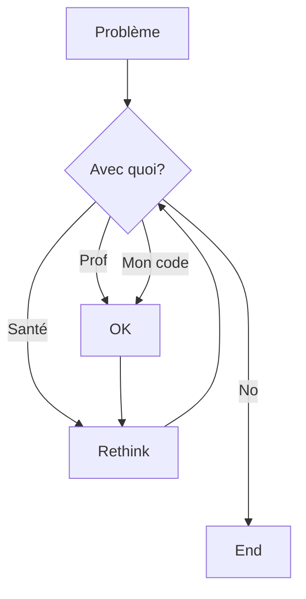

# Tu as un problème au département

Ceci est la page avec les ressources.

## Problème personnel, santé physique ou mentale

## Problème d'argent

## Problème avec un professeur

## Problème avec mon code
Si tu as un problème avec ton code, regarde la page suivante:
[débogage](debogage.md)

## Résumé et schéma visuel

