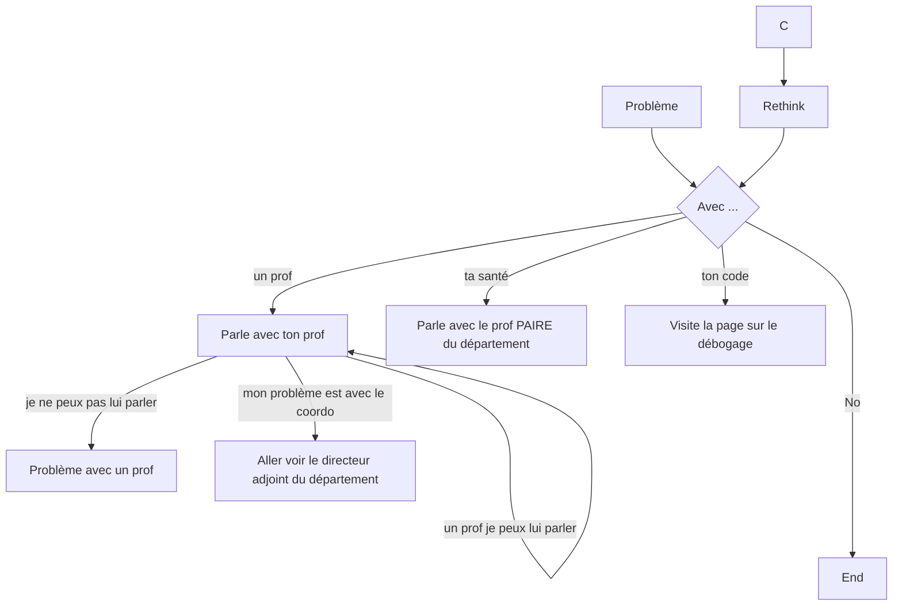

# Tu as un problème pendant tes études

Cette page sert à te guider vers les bonnes resources si ça ne va pas pendant ton DEC.

## Problème personnel, santé physique ou mentale, problème d'argent

Si ce n'est pas facile d'en parler, n'hésite pas à approcher le prof ou l'employé du collègue avec lequel tu es le plus à l'aise.

Si tu as une situation et que tu es fatigué de répéter, adresse toi aux profs PAIRE. Avec ton accord, ils pourront partager
avec toutes les personnes qui peuvent t'aider.

**EN BREF :**  *Profs PAIRE, personne avec qui tu es à l'aise*

## Problème avec un professeur

Si tu as un conflit / problème avec un professeur, nous te recommandons les étapes suivantes:
- Essaie d'en parler avec le/la prof
- Si cela ne résoud pas le problème, si tu ne souhaites pas en parler avec le prof, tu peux ensuite t'adresser à la coordination du département
- Si le problème est avec la coordination ou que tu n'es pas à l'aise, tu peux en parler avec un enseignant de ton choix ou alors à la direction des études.
- Dans tous les cas, ce que tu dis ne sera pas communiqué au prof, sauf si tu es d'accord et pour régler la situation

**EN BREF :**  *Prof, coordo ou direction*

### Retard ou absence d'un prof

Si un professeur est absent ou en retard dans un cours, que ça se répète, que ce n'est pas affiché sur Omnivox ou les écrans au collège,
passe prévenir la coordination.

### Retard de correction

Nous devons te remettre ta copie avec des commentaires et des retours (une retroaction) dans les 3 semaines après la remise du travail.

Si ce n'est pas le cas, n'hésite pas à le mentionner ... au prof ou à la coordination.

### Plaintes

Tu peux produire une plainte concernant un professeur auprès de la direction des études (notre "boss"). Si tu as besoin d'aide dans le processus, n'hésite pas à en parler avec la coordination.

## Problème avec mon code
Si tu as un problème avec ton code, regarde la page suivante:
[débogage](debogage.md)

## Résumé et schéma visuel

